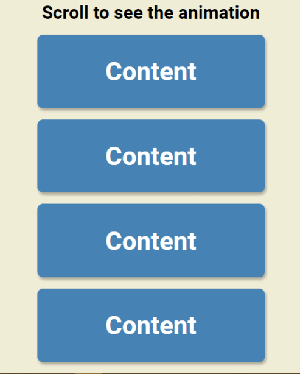

# scroll_animation
>Simple scroll animation - the contents come from left and right 
 
Deployment ˚ ༘✶ ⋆｡˚ ⁀➷[_here_](https://rhanateix.github.io/expanding_cards/)

## Table of Contents
* [General Info](#general-information)
* [Technologies Used](#technologies-used)
* [Notes](#notes)
* [Screenshots](#screenshots)
* [Project Status](#project-status)
* [Room for Improvement](#room-for-improvement)
* [Acknowledgements](#acknowledgements)
* [Contact](#contact)

»»————-　★　————-««»»————-　★　————-««»»————-　★　————-««»»————-　★　

## General Information

- What problem does it (intend to) solve? Simple and usefull animation for daytoday 
- What is the purpose of your project? Sharpening skils
- Why did you undertake it? I want to improve my skills, specially in JS

## Technologies Used
- HTML5
- CSS3
- JavaScript

## Notes
  
  ˚ ༘✶ ⋆｡˚ ⁀➷ This project was made by and with the purpose of learning 
    
  
## Screenshots

## Project Status
Project is: / _complete_ /

## Room for Improvement

- Explore more screen sizes (responsive)
- Include in IRL project

## Acknowledgements

- This project was idealize by the course [50 projects in 50 days](https://www.udemy.com/course/50-projects-50-days/)
- Many thanks to [Brad Traversy](https://github.com/bradtraversy)• ₊°✧︡ ˗ ˏ ˋ ° ˎˊ ˗

## Contact
Created by [@RhanaTeix](https://www.linkedin.com/in/rhan%C3%A1-teixeira-111181227/) - feel free to contact me!

»»————-　★　————-««»»————-　★　————-««»»————-　★　————-««»»————-　★　
